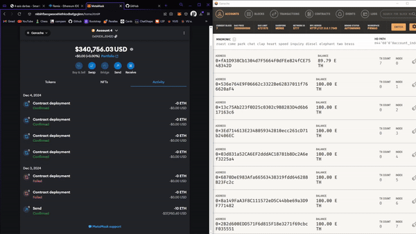

# Subscription-Service Išmanusis Kontraktas

## Verslo logika

### Įvadas  
`SubscriptionService` išmanioji sutartis sukurta tam, kad leistų vartotojams užsisakyti prenumeratos paslaugas Ethereum blokų grandinėje. Ji suteikia galimybę pasirinkti skirtingus prenumeratos planus (Bazinis arba Premium) ir siūlo papildomas funkcijas, tokias kaip ankstyvo atnaujinimo nuolaidos ir pranešimai apie artėjančią prenumeratos pabaigą.

### Dalyviai ir jų vaidmenys  
1. **Savininkas (owner):**  
   - Valdo sutartį.
   - Gali išsiimti sukauptas lėšas ir nustatyti prenumeratos mokesčius.

2. **Prenumeratoriai (subscribers):**  
   - Vartotojai, kurie užsisako prenumeratas.
   - Gali atnaujinti prenumeratas ir gauti pranešimus apie galiojimo pabaigą.

### Verslo logika ir funkcionalumas  
1. **Prenumeratos planai:**  
   - **Bazinis planas:**
     - Mokestis: `0.01 ETH`
     - Trukmė: `30 dienų`
   - **Premium planas:**
     - Mokestis: `0.05 ETH`
     - Trukmė: `90 dienų`
   
2. **Ankstyvo atnaujinimo nuolaidos:**
   - Jei vartotojas atnaujina prenumeratą dar prieš jos galiojimo pabaigą, taikoma `10%` nuolaida.

3. **Pranešimai apie galiojimo pabaigą:**  
   - Jei liko mažiau nei `3 dienos` iki prenumeratos pabaigos, išsiunčiamas pranešimo įvykis (`NearExpiration`).

4. **Mokėjimų ir prenumeratų valdymas:**  
   - Prenumeratos mokestis turi būti lygus nurodytai sumai, kad sandoris būtų sėkmingas.
   - Savininkas gali išsiimti visas sukauptas lėšas iš sutarties.

### Pagrindinės funkcijos
1. **subscribe(Tier tier):**  
   Leidžia vartotojui pasirinkti prenumeratos planą ir apmokėti už paslaugą. Atnaujina prenumeratos galiojimo laikotarpį.

2. **renewSubscription():**  
   Atnaujina vartotojo prenumeratą, taikant nuolaidą, jei ji atnaujinama dar prieš galiojimo pabaigą. Atnaujina galiojimo datą.

3. **checkSubscription():**  
   Patikrina, ar prenumerata vis dar galioja, ir grąžina `true`, jei taip.

4. **checkNearExpiration():**  
   Jei prenumerata baigsis per artimiausias `3 dienas`, išsiunčia pranešimą apie artėjančią pabaigą (`NearExpiration`).

5. **withdrawFunds():**  
   Leidžia sutarties savininkui išsiimti sutartyje sukauptas lėšas.

> [!NOTE]  
> Ši logika buvo įgyvendinta `PirminisVariantas` folderyje.

